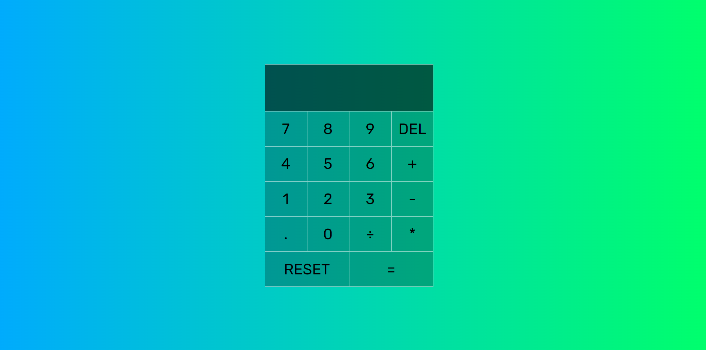
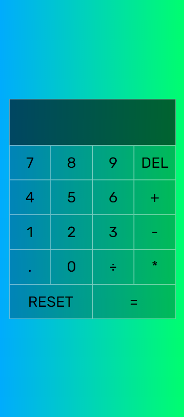

<html>
  

  <h1> THE CALCULATOR </h1>
  <h3> Just a Simple Calculator made by a Programmer just to Practice JavaScript Skills! </h3>
  

  

     
     
  

  

  <h3>Tap on this Link to check it out: https://eshantrivedi21.github.io/Calculator/</h3>
  

</html>
